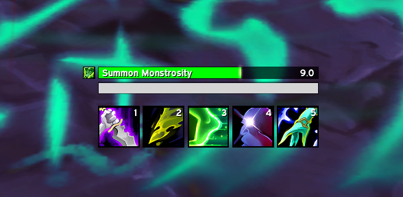
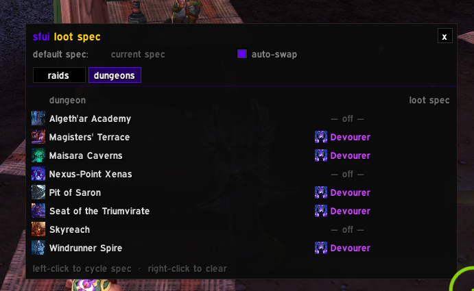
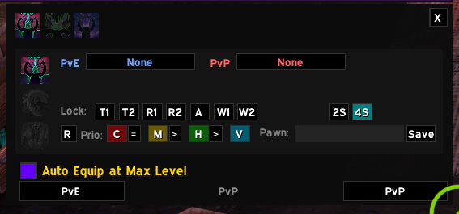
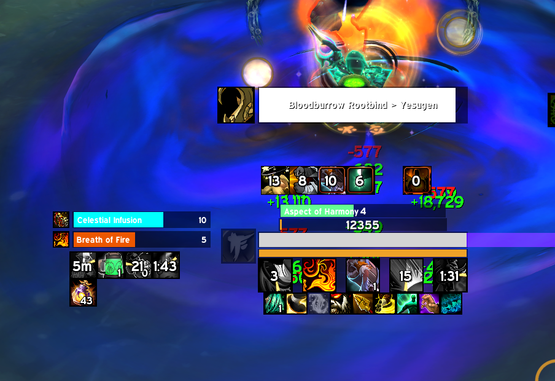
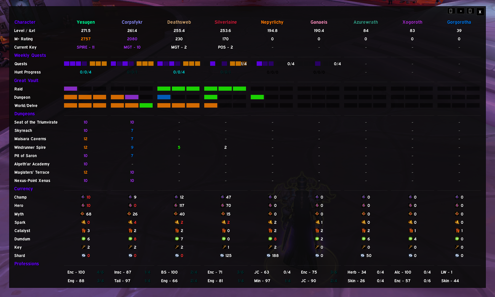
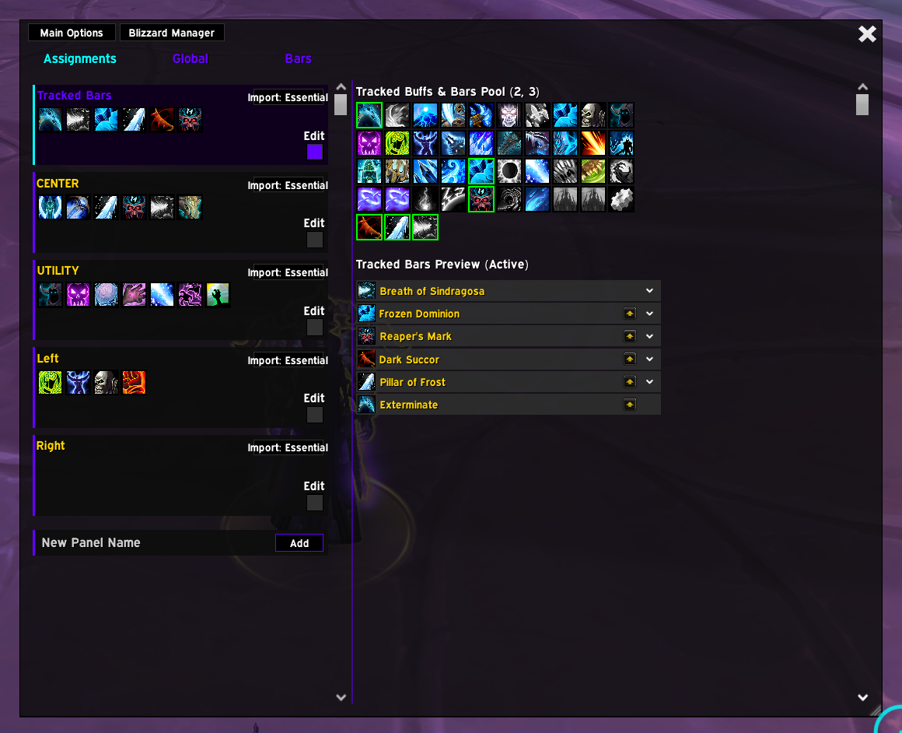
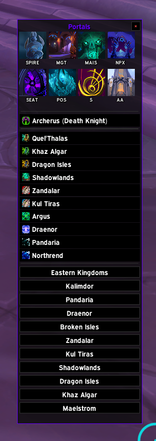

# sfui (beta)

Additions and helpers for the World of Warcraft UI.
Designed to replace lost WeakAuras, bloated unit frames, and complex configurations with clean, lightweight, and zero-allocation modular components.

## Overview
Modular, lightweight, and "set-and-forget" interface. Handles functionality that typically requires multiple addons. Focuses on clarity, performance, and automation.

Supports [Masque](https://www.curseforge.com/wow/addons/masque) for button skinning. Screenshots use [Masque: Caith](https://www.curseforge.com/wow/addons/masque-caith).

---

## Features

### Vehicle & Possess HUD
A fully integrated, combat-safe vehicle interface driven exclusively by secure state drivers.
- **Unified Stack**: Aligned directly to player healthbar coordinates, featuring a **Vehicle Castbar** (with animated spark, timer, and icon), **Vehicle Health Bar** (clean minimalist statusbar), and **Vehicle Power Bar** (resource-colored for energy, mana, steam, rage).
- **Action Buttons**: 6 styled action buttons with range/usable tinting and Masque support.
- **Auto Suppression**: Automatically suppresses the player's primary health/power bars and attached cooldowns while in vehicles or possess mode.

*Vehicle Interface*

---

### Quest Log & Objective Tracker
A lightweight, taint-free replacement for Blizzard's default Objective Tracker.
- **Zero-Taint Architecture**: Completely isolated from Blizzard's `UIWidgetManager` and secret layout frames to prevent protected action blocks in Mythic+ and Delves.
- **World Events & Scenarios**: Full tracking for outdoor scenarios and World Events (Community Feast, Siege on Dragonbane Keep, Theater Troupe, Superbloom, Time Rifts, Radiant Echoes) with dynamic criteria extraction.
- **World Quest Summary**: Clean popover list (`/sfwqs`) with reward filtering, zone groupings, and pin supertracking.

---

### Memory Profiler & Pool Inspector
An interactive Dark Glass diagnostic GUI accessible via `/sfmem`, `/sfui mem`, or the **debug** tab in `/sfui`.
- **Live Telemetry**: Real-time memory allocation rate meters (`KB/s`), live GC metrics, and 10s/30s benchmark runs.
- **Module Pool Grid**: Real-time inspection of active frame pools, table pools, and cache sizes across all 19 addon modules.

---

### Loot Spec Swapper
A fast menu attached to the loot frame or character panel to rapidly override your current loot specialization.
- **Visual Indicators**: Color-coded spec buttons make it obvious what spec's loot table you are rolling against.
- **Convenience**: Quickly target off-spec weapons or trinkets without digging through default UI portraits.

---

### Gear Manager
A dedicated, floating Gear Manager window accessed via the Character panel.
- **Auto Equip Engine**: Automatically detects and equips upgrades when items drop into bags based on highest-ilvl logic per-slot.
- **Smart Validation**: Gracefully ignores grey/white quality items and correctly handles dynamic primary stat shifting (e.g. Agility/Intellect per spec).
- **Multi-Spec Profiles**: Independent PvE and PvP configurations per specialization that automatically swap gear on Battleground or Arena entry.
- **Slot Locking**: Lock specific trinkets or slots to prevent them from being overwritten.

---

### Tracking Manager & Tracked Bars
Powerful cooldown and aura tracking system that integrates seamlessly with your character frame.
- **Smart Attachment**: Stack tracked bars directly above your Health or Secondary Power bar for a unified HUD.
- **Dynamic Layout**: Automatically adjusts positioning based on resource bar visibility, maintaining a clean interface.
- **Stack Mode**: Visualize stack counts as a progress bar or centered text for clarity.
- **Flexible Display**: Customize colors, text alignment, and visibility per ability.

---

### Castbars
Enhanced cast visualization for both player and target.
- **Player Castbar**: Clean, high-fidelity bar with integrated **Instant Cast Tracking** (shows a quick highlight when instant spells are used). Supports Empowered (Evoker) spell stages with dynamic color shifting.
- **Target Castbar**: High-visibility bar positioned for better combat awareness. Distinct colors for interruptible vs. non-interruptible spells.

---

### Player Status & Resources
Health, primary power, and secondary resources (Stagger, Runes, Devourer Fragments, etc.) with custom class/spec color inheritance.

---

### Skyriding HUD
Streamlined interfaces for current flight systems with improved visibility for vigor and mount speed.

*Skyriding HUD*

---

### Alts Manager & Great Vault
Track alternate characters' item levels, lockouts, weekly activities, currencies, and Great Vault reward progress with item level and upgrade track tooltips.

---

### Cooldown Manager (CDM)
A dynamic scrolling tracker to monitor important active auras, procs, and cooldowns.

---

### Portals & Teleports
An organized UI for quick access to all character teleport toys, spells, and hearthstones, categorized by expansion and location.

---

### Merchant Frame
Redesigned merchant interface with filtering and currency display.
- `Ctrl + Click` to preview items
- `Shift + RightClick` to buy stacks or max affordable
- Integrated housing decor filtering (toggleable in options)

---

### Automation
Quality of life features to streamline daily tasks:
- **Auto Role Check**: Automatically accepts role checks.
- **Enhanced LFG**: Double-click groups in the LFG tool to sign up instantly.
- **Auto-Sell Greys**: Automatically sells grey items at vendors.
- **Auto-Repair**: Automatically repairs gear (prioritizing guild repairs).
- **Master's Hammer System**: Sequential repair popup with keybind support.

